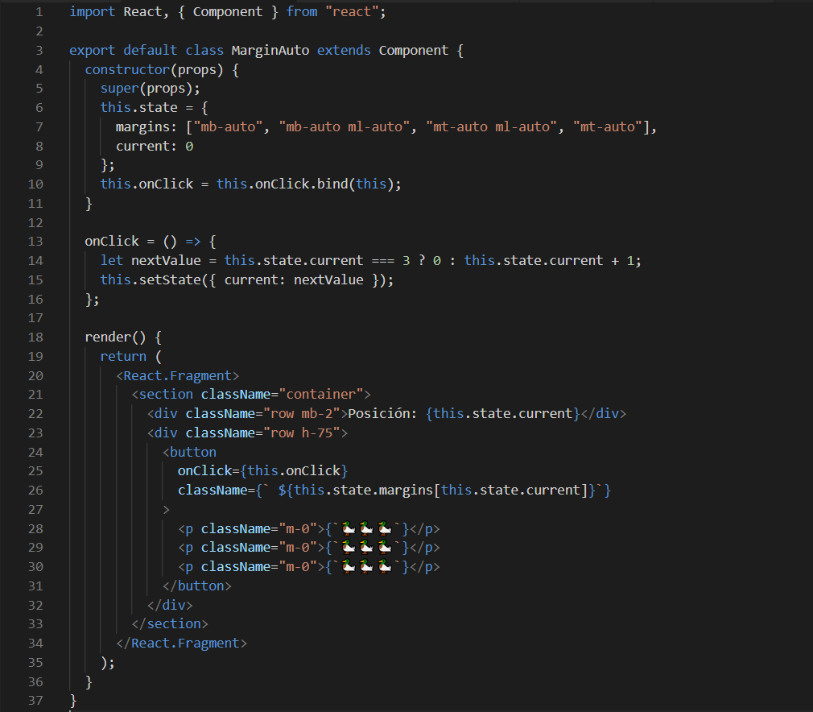
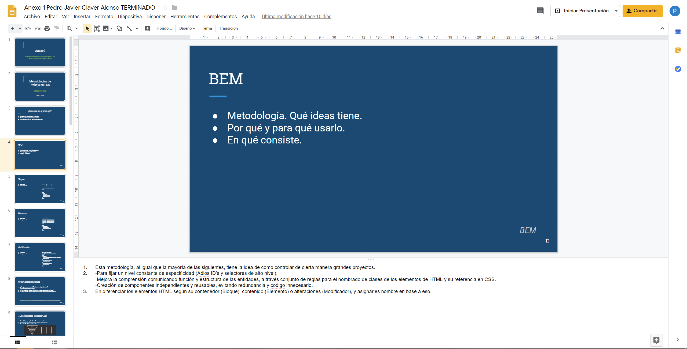

import { Image } from 'mdx-deck'
import { Appear } from "@mdx-deck/components";
export { code as theme } from "@mdx-deck/themes";
import "./node_modules/bootstrap/dist/css/bootstrap.min.css";
import FlexLayout from "./src/Layouts/FlexLayout";

import { SplitRight, Split, FullScreenCode } from "@mdx-deck/layouts";

<SplitRight>

# Loading...

</SplitRight>

---

  <h1>Memorias de unas prácticas de empresa</h1>
  <h3 className="mt-5">Pedro J. Claver</h3>

---

## Atención

## No es una guía de introducción.

## Es un resumen personal de mi experiencia en la empresa.

---

<SplitRight>

<section>
  
Hola

  
Soy Pedro J. Claver

</section>

</SplitRight>

---

# Sobre mí

<ul className="mt-4 py-4">
  <Appear>
    <li className="h3"> Todo empezó gustandome la informática </li>
    <li className="h3">
      {" "}
      Tenía interés por la programación y el desarrollo en general{" "}
    </li>
    <li className="h3"> Apenas sabía algo de C# hace muchos años </li>
    <li className="h3"> Uso mucho el ordenador</li>
    <li className="h6">Me gustan los patos</li>
  </Appear>
</ul>

---

# Formacion Previa

<ul className="mt-4 py-4">
  <li className="h3">
    {" "}
    Grado Medio:
    
Titulado en Sistemas Microinformáticos y redes

  </li>
  <li className="h3">
    {" "}
    Formación autodidacta
    
Lecturas varias, cursillos online, bases de Python...

  </li>
</ul>

---

<FlexLayout column>
  

    <h2>Formación en las aulas</h2>
    <h3 className="text-center">Conocimientos más desempeñados</h3>
  

  <ul className="mt-4 py-4">
    <li className="h4">Programación básica en Java</li>
    <li className="h4">Manejo de BB.DD</li>
    <li className="h4">Desarrollo de interfaces y lenguajes de marcas</li>
    <li className="h4">Desarrollo web</li>
    <li className="h4">Analisis y gestión de proyectos</li>
  </ul>
</FlexLayout>

---

# Antes de las prácticas

1. Entrevista previa, en Mayo.
1. Desde Junio hasta Septiembre, Ruby on Rails.
1. En septiembre, cambio de planes.

---

<Split>

# Sobre mi empresa y sus relaciones:

# AgileDevers, Coddde, LenioLabs.

</Split>

---

# La "historia" de AgileDevers

<ul className="mt-4 py-4">
  <Appear>
    <li>Nacida en 2012, Madrid</li>
    <li>Fundada por Fabio Sanvido, Jesus García y Iago Rodriguez</li>
    <li>
      Primera localización en Tirso de Molina, expandiendo a todo el mundo
    </li>
    <li>Creciendo como Coddde, formando parte de LenioLabs</li>
  </Appear>
</ul>

---

<section className="py-3">

# Sobre la actividad en AgileDevers

<ul className="m-2 p-2">
  <Appear>
    <li className="m-2 mx-4 h2">
      {" "}
      Empresa dedicada al desarrollo y mantenimiento de aplicaciones.
    </li>
    <li className="m-2 mx-4 h2">
      {" "}
      Proporcionaba estos servicios a start-ups y otras empresas.
    </li>
    <li className="m-2 mx-4 h2">
      {" "}
      Antes se centraban en aplicaciones basadas en Javascript y Ruby on Rails
    </li>
    <li className="m-2 mx-4 h2">
      {" "}
      Actualmente, se están ampliando a más cosas, como Node.js y React.js
    </li>
  </Appear>
</ul>

</section>

---
# A nivel personal

Ya sea con compañeros del año pasado que también contrataron, gente que lleva allí un tiempo, o que están ahí desde que empezaron, parecen gente muy compentente y bastante agradables.
Tanto a nivel personal como profesional, cualquiera con quien haya hablado, siempre ha tenido algo que aportar.
  
O incluso con la gente de Coddde y de Lenio trabajando al otro lado del mundo. Aunque se hace algo más complicado, son igual de cercanos siempre atentos a cualquier cosa por Slack.

---

<section>
  <h2>Comienzo de las prácticas</h2>

1. Malas noticias: De Back-end, a front-end.

2. Empieza el periodo de formación.

</section>

---

## Con el cambio, toca repasar:

# Contenido visto durante las prácticas

<ul className="mt-3 pt-3">
  <li className="h3 my-3">
    Bases de Tecnologías web actuales:
    
HTML5, CSS3, SASS, librerías y metodologías de de CSS.

  </li>
  <li className="h3 my-3">
    Programación basada en Javascript actual:
    
Repaso de bases, ES6, errores comunes, "Gotchas"

    
"Event loop" de Javascript, motor V8

    
Promesas y asincronía en Javascript

    
Funcionamiento de Node y npm

  </li>
  <li className="h3 my-3">
    React.js
    
Bases y teoría

    
Tipos de componentes: props y state

    

      Ciclos de vida, funcionamiento de motor de renderizado, VirtualDOM
    

    
Uso básico y práctico de React con JSX

  </li>
  <li className="h3 my-3">
    Librerías adicionales a React,js
    
Redux, React-redux, React-router Etc...

  </li>
</ul>

---

import MarginAuto from "./src/Components/MarginAutospan";

 Ejemplo básico de React y manejo del State 

<FlexLayout>
  
  <MarginAuto />

</FlexLayout>

---

  <picture>
    
  </picture>

---

# Rutina de la formación y formato de las presentaciones

<ol className="container">
  <Appear>
    <li className="h3 mx-2">
      Asignación de tareas y listado de temas a cubrir.
    </li>
    <li className="h3 mx-2">
      Investigación, estudio de la documentación, y pruebas.
    </li>
    <li className="h3 mx-2">Pruebas y aplicación de lo aprendido.</li>
    <li className="h3 mx-2">
      Maquetación de diapositivas y repaso de lo aprendido.*
    </li>
    <li className="h3 mx-2">Exposición, discusión, brainstorming y crítica.</li>
  </Appear>
</ol>

---

# Diapositiva de ejemplo

  <picture>
    
  </picture>

---

# Para una mejor referencia, revisar el Anexo 1.

---

# El primer proyecto:

## Caracteristicas del proyecto

- Antiguo proyecto hecho en Angular
- Poco a poco, obsoleto a nivel tecnológico.
- Funciones a impementar y mejorar
- Revisar y mejorar

---

# Primeros retos, compenzamos el dessarrollo: Primeras tareas

<ol className="container">
  <li className="h3">Coger costumbre con el entorno de desarrollo.</li>
  <li className="h3">Analisis previo del proyecto.</li>
  <li className="h3">
    Reconocer todos los componentes importantes y reutilizables
    -(Con analisis previo o anotaciones)
  </li>
  <li className="h3">
    Elaboración de componentes atómicos de prueba para su uso posterior en
    componentes de página.
    
      -(Manejo de componentes como piezas de puzzles en componentes de página)
    
  </li>
  <li className="h3">
    Instauración de manejo y guardado del repositorio de código.
    Basados en GitLab y GitKraken.
  </li>
</ol>

---

# Avanzando, cambios en la gestión.

<ul className="mt-4 py-4 container">
  <Appear>
    <li className="h3">
      {" "}
      Se estudió la productividad y se cambió la gestión del proyecto.
    </li>
    <li className="h3"> Pasamos de ser 4 a 2 personas en el proyecto.</li>
    <li className="h3"> Se me encargó todo el front-end.</li>
    <li className="h3"> Empezaron a darse Deadlines mensuales</li>
    <li className="h3">
      {" "}
      Mi codigo era revisado cada vez que terminabamos unas implementaciones.
    </li>
  </Appear>
</ul>

---

# Implementando más librerias, juntando partes del puzzle

<ul className="mt-4 py-">
  <Appear>
    <li className="h3 mx-2">
      Implementamos redux para ciertos componentes y páginas
    </li>
    <li className="h3 mx-2">Se comenzó la maquetación de las páginas</li>
    <li className="h3 mx-2">
      En la maquetación, implementamos los componentes previamente creados
    </li>
    <li className="h3 mx-2">
      Se iban completando páginas para enseñar all cliente.
    </li>
    <li className="h3 mx-2">
      Se iban completando páginas para enseñar all cliente.
    </li>
  </Appear>
</ul>

---

# Todavía más Redux

## En este caso de uso:

<ul className="mt-4 py-4">
  <Appear>
    <li className="h3 mx-2">
      Teniendo varios componentes entre páginas que necesitan compartir datos.{" "}
    </li>
    <li className="h3 mx-2">
      Manejar el estado de distontos componentes, puede ser un lio.{" "}
    </li>
    <li className="h3 mx-2">
      Puede ser sensible a la mutación si no se gestiona correctamente{" "}
    </li>
    <li className="h3 mx-2">
      Tener bien atadas la asincronía, y todos los cambios de estado Redux
    </li>
  </Appear>
</ul>

---

  

    

      {" "}
      Para este fin, se crearon metodologías, como Flux.{" "}
    

    

      {" "}
      Dichas metodologías se vieron necesarios fijarlos dentro de una librería:{" "}
    

    
Así nace Redux y sus premisas:

  

  <ul>
    <Appear>
      <li> Estado global.</li>
      <li> Es sólo lectura.</li>
      <li> Cambios sólo con funciones puras.</li>
    </Appear>
  </ul>

---

  {" "}
  Para más detalles o curiosidades acerca del tema, revisar <a href="https://www.youtube.com/watch?v=xsSnOQynTHs&ab_channel=ReactEurope">
    {" "}
    charla de Dan Abramox
  </a>

---

# Más en adelante:

<ul className="mt-4 py-4">
  <Appear>
    <li className="h3">
      Empezamos a tener un feedback directo de los clientes
    </li>
    <li className="h3">Nos adaptamos a la curva de aprendizaje de Redux</li>
    <li className="h3">
      Empezamos a dar mayor importancia a los boards de Gitlab para la
      asignación de tareas
    </li>
    <li className="h3">
      Implementamos nuevas librerías para intentar "reinventar la rueda"
    </li>
    <li className="h3">
      Supervisor con poco tiempo, pero con grandes soluciones
    </li>
  </Appear>
</ul>

---

<SplitRight>

<section>
  <h2>
    Basicamente, gran parte del tiempo, me la pasaba haciento *Rubber-duck
    debugging.*
  </h2>
</section>

_Imagen real de mi puesto en la oficina_ 

</SplitRight>

---

<h2>Empezando a darle forma</h2>

<h4>Sobre Marzo, empezamos a ver que ya teníamos unas rutinas, y en este periodo de tiempo hicimos lo siguiente</h4>

<ul className="mt-4 py-4">
  <Appear>
    <li className="h3">Trabajamos en la asincronía de las peticiones ajax.</li>
    <li className="h3">
      Por falta de documentación, tocó replicar la aplicación investigando
    </li>
    <li className="h3">
      Empezamos a dar mayor importancia a los boards de Gitlab para la
      asignación de tareas
    </li>
    <li className="h3">
      Implementamos nuevas librerías para intentar "reinventar la rueda"
    </li>
    <li className="h3">
      Supervisor con poco tiempo, pero con grandes soluciones
    </li>
    <li className="h3">
      El cliente empezó a pedir nuevas cosas y comentar necesidades nuevas
    </li>
  </Appear>
</ul>

---

## Recta final: primeras alphas, bugs...

  

    En marzo, ya teníamos las deadlines bien ajustadas pero...
  

  <Appear>
    <ul className="mt-4 py-4">
      <li className="h3">
        Los cambios mencionados antes, implicaron cambiar y testear
        minuciosamente la aplicación vieja.
      </li>
      <li className="h3">
        {" "}
        Esto conllevó dedicar tiempo hacer y revisar esto:
        <ol>
          <li className="h5">
            Los requisitos y necesidades de la deadline, no eran claros, hubo
            que hacer nuevas tareas.
          </li>
          <li className="h5">La documentación seguía siendo un problema.</li>
          <li className="h5">
            Por ello se tuvo que investigar la original para replicarla.
          </li>
          <li className="h5">
            Descubrimos implementaciones necesarias que nunca habían sido
            habladas.
          </li>
        </ol>
      </li>
      <li className="h3">
        Empezamos a dar mayor importancia a los boards de Gitlab para la
        asignación de tareas
      </li>
      <li className="h3">
        Implementamos nuevas librerías para evitar "reinventar la rueda" y
        perder más tiempo del necesario
      </li>
      <li className="h3">
        Supervisor con poco tiempo, pero con grandes soluciones
      </li>
      <li className="h3">
        El cliente empezó a pedir nuevas cosas y comentar necesidades nuevas
      </li>
    </ul>
  </Appear>

---

### Por estas razones, aún se sigue trabajando en el proyecto.

---

<h2>*Conclusión. Analisis de objetivos y resultados obtenidos.*</h2>

---

En mi humilde opinión: Aún tengo mucho que aprender. 

He aprendido mucho y me he esforzado, en la oficina parecen estar contentos conmigo.

Puede que al comienzo, no me vieran preparado, y es comprensible dadas las circunstancias.

Pero apostaron por __mi__
 

Y desde que empecé el curso, no me ha gustado la idea de tirar la toalla.

---

Es cierto que todavía tengo mucho que aprender.

Pero en estos meses he trabajado duro. Y se han dado cuenta de ello.

Puede que sea por eso por lo que me haya visto recompensado.
 

 Ya sea con una modesta subida de suelo o con un contrato que me permita seguir trabajando.

Y con esto concluyo en que pienso que más que haber obtenido, para seguir trabajando como programador, he adquirido el objetivo de seguir aprendiendo. 

