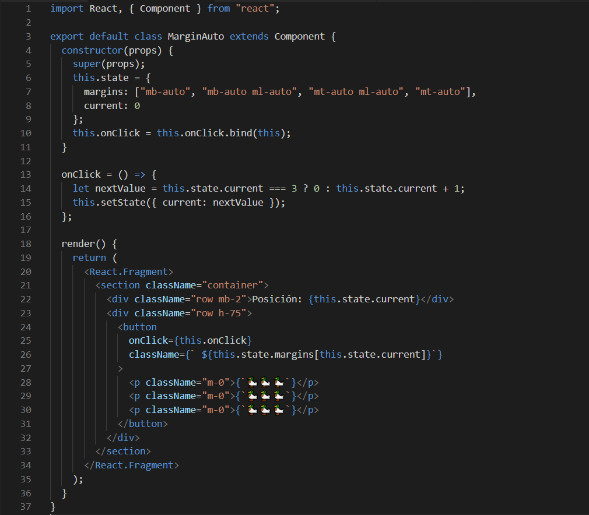
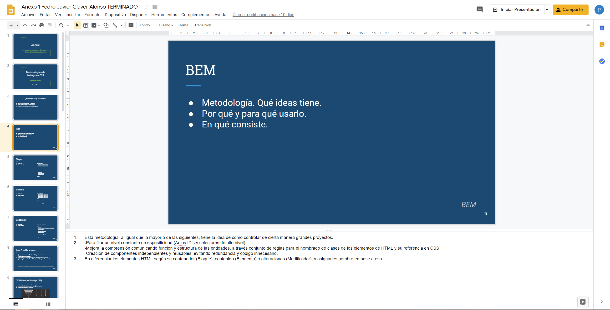

import { Appear } from "@mdx-deck/components";
export { code as theme } from "@mdx-deck/themes";
import "./node_modules/bootstrap/dist/css/bootstrap.min.css";
import FlexLayout from "./src/Layouts/FlexLayout";

import { SplitRight, Split, FullScreenCode } from "@mdx-deck/layouts";

<SplitRight>

# Loading...

</SplitRight>

---

  <h1>Memorias de unas prácticas de empresa</h1>
  <h3 className="mt-5">Pedro J. Claver</h3>

---

## Atención

## No es una guía de introducción.

## Es un resumen personal de mi experiencia en la empresa.

---

<SplitRight>

<section>
  
Hola

  
Soy Pedro J. Claver

</section>

</SplitRight>

---

# Sobre mí

<ul>
  <Appear>
    <li className="h3"> Todo empezó gustandome la informática </li>
    <li className="h3">
      {" "}
      Tenía interés por la programación y el desarrollo en general{" "}
    </li>
    <li className="h3"> Apenas sabía algo de C# hace muchos años </li>
    <li className="h3"> Uso mucho el ordenador</li>
    <li className="h6">Me gustan los patos</li>
  </Appear>
</ul>

---

# Formacion Previa

<ul>
  <li className="h3">
    {" "}
    Grado Medio:
    
Titulado en Sistemas Microinformáticos y redes

  </li>
  <li className="h3">
    {" "}
    Formación autodidacta
    
Lecturas varias, cursillos online, bases de Python...

  </li>
</ul>

---

<FlexLayout column>

  <h2>Formación en las aulas</h2>
  <h3 className="text-center">Conocimientos más desempeñados</h3>

<ul>
  <li className="h4">Programación básica en Java</li>
  <li className="h4">Manejo de BB.DD</li>
  <li className="h4">Desarrollo de interfaces y lenguajes de marcas</li>
  <li className="h4">Desarrollo web</li>
  <li className="h4">Analisis y gestión de proyectos</li>
</ul>
</FlexLayout>

---

# Antes de las prácticas

1. Entrevista previa, en Mayo.
1. Desde Junio hasta Septiembre, Ruby on Rails.
1. En septiembre, cambio de planes.

---

<Split>

# Sobre mi empresa y sus relaciones:
# AgileDevers, Coddde, LenioLabs.

</Split>

---

# La "historia" de AgileDevers

<ul>
  <Appear>
    <li>Nacida en 2012, Madrid</li>
    <li>Fundada por Fabio Sanvido, Jesus García y Iago Rodriguez</li>
    <li>
      Primera localización en Tirso de Molina, expandiendo a todo el mundo
    </li>
    <li>Creciendo como Coddde, formando parte de LenioLabs</li>
  </Appear>
</ul>

---

<section className="py-3">

# Sobre la actividad en AgileDevers

<ul className="mt-2 p-2">
  <Appear>
    <li className="h2">
      {" "}
      Empresa dedicada al desarrollo y mantenimiento de aplicaciones.
    </li>
    <li className="h2">
      {" "}
      Proporcionaba estos servicios a start-ups y otras empresas.
    </li>
    <li className="h2">
      {" "}
      Antes se centraban en aplicaciones basadas en Javascript y Ruby on Rails
    </li>
    <li className="h2">
      {" "}
      Actualmente, se están ampliando a más cosas, como Node.js y React.js
    </li>
  </Appear>
</ul>

</section>

---

# Comienzo de las prácticas

1. Malas noticias: De Back-end, a front-end.

2. Empieza el periodo de formación.

---
## Con el cambio, toca repasar:
# Contenido visto durante las prácticas

<ul className="mt-3 pt-3">
  <li className="h3 my-3">
    Bases de Tecnologías web actuales:
    
HTML5, CSS3, SASS, librerías y metodologías de de CSS.

  </li>
  <li className="h3 my-3">
    Programación basada en Javascript actual:
    
Repaso de bases, ES6, errores comunes, "Gotchas"

    
"Event loop" de Javascript, motor V8

    
Promesas y asincronía en Javascript

    
Funcionamiento de Node y npm

  </li>
  <li className="h3 my-3">
    React.js
    
Bases y teoría

    
Tipos de componentes: props y state

    

      Ciclos de vida, funcionamiento de motor de renderizado, VirtualDOM
    

    
Uso básico y práctico de React con JSX

  </li>
  <li className="h3 my-3">
    Librerías adicionales a React,js
    
Redux, React-redux, React-router Etc...

  </li>
</ul>

---

import MarginAuto from "./src/Components/MarginAutospan";

 Ejemplo básico de React y manejo del State 

<FlexLayout>
  
  <MarginAuto />

</FlexLayout>

---

  <picture>
    
  </picture>

---

# Rutina de la formación y formato de las presentaciones

<ol>
  <Appear>
    <li>Asignación de tareas y listado de temas a cubrir.</li>
    <li>Investigación, estudio de la documentación, y pruebas.</li>
    <li>Pruebas y aplicación de lo aprendido.</li>
    <li>Maquetación de diapositivas y repaso de lo aprendido.*</li>
    <li>Exposición, discusión, brainstorming y crítica.</li>
  </Appear>
</ol>

---

# Diapositiva de ejemplo

  <picture>
    
  </picture>

---

# Para una mejor referencia, revisar el Anexo 1.

---

# El primer proyecto:

## Caracteristicas del proyecto

- Antiguo proyecto hecho en Angular
- Poco a poco, obsoleto a nivel tecnológico.
- Funciones a impementar y mejorar
- Replicar y mejorar

---

# Primeros retos, compenzamos el dessarrollo: Primeras tareas

<ol className="container">
  <li className="h3">Coger costumbre con el entorno de desarrollo.</li>
  <li className="h3">Analisis previo del proyecto</li>
  <li className="h3">
    Reconocer todos los componentes importantes y reutilizables{" "}
    (Con analisis previo o anotaciones)
  </li>
  <li className="h3">
    
      Elaboración de componentes atómicos de rpueba para su uso posterior en
      componentes de página
    
  </li>
  
    (Manejo de componentes como piezas de puzzles en componentes de página)
  
  <li className="h3">
    Instauración de manejo y guardado del repositorio de código.
    Basados en GitLab y GitKraken.
  </li>
</ol>

---

# Avanzando, cambios en la gestión.

---

# Test Custom Layout

<FlexLayout flow="row nowrap">
  
Cobaya 

  
El nocillo 

  
</FlexLayout>

---

## ptata

---

<ul>
  <li>* I am another bullet list item</li>
  <Appear>
    <li>* I am a bullet list item</li>
    <li>* I am another bullet list item</li>
  </Appear>
</ul>

---

# SLIDE 2 - HEADERS

## Header 2

### Header 3

#### Header 4

##### Header 5

---

# SLIDE 3 - TABLE

| Fruit        | Weight | Cost   |
| ------------ | ------ | ------ |
| Strawberries | 16oz   | \$3.99 |
| Blueberries  | 8oz    | \$2.99 |
| Grapes       | 12oz   | \$3.75 |
